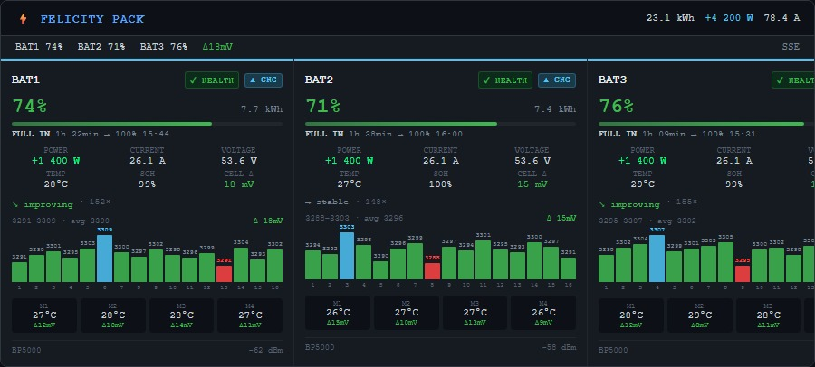
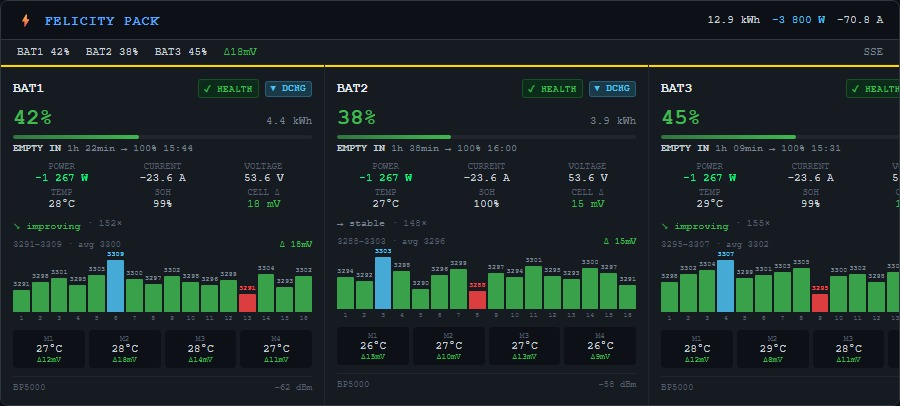

# Felicity Battery Cards

Real-time Lovelace dashboard cards for **Felicity Solar** battery systems, powered by [mcp-fsolar](https://github.com/RicardoSantos/mcp-fsolar).

## Cards

### ⚡ Felicity Fleet Card

Live fleet overview with per-battery panels showing:
- SOC, voltage, current, power — updated live via SSE
- 16-cell voltage bars with colour-coded health (green/blue/red/orange)
- Cell hover tooltips: LiFePO4 %, pack spread, module temp
- FULL IN / EMPTY IN time estimates
- Module temperature grid
- Charge/discharge/balance state badges

### 📊 Felicity History Card

24-hour trend analysis:
- Cell Δ (mV) line chart with threshold annotations
- Max temperature chart per battery
- Cell deviation heatmap (16 cells × N batteries)
- Daily and lifetime tabs

## Requirements

- [mcp-fsolar](https://github.com/RicardoSantos/mcp-fsolar) running and reachable from HA
- Home Assistant 2023.1+
